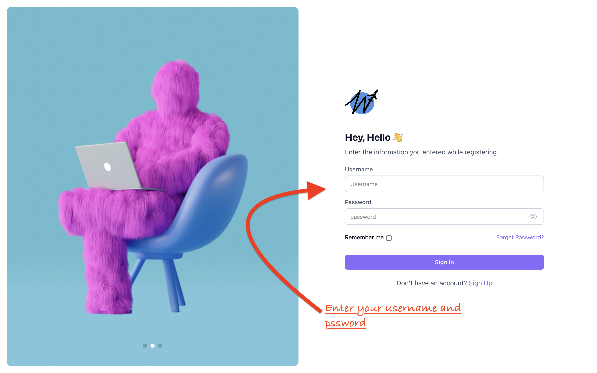

<h1 align="center">
  <br>
  <a></a>
  <br>
  Wander-Mate
  <br>
</h1>
<h1 align="center"># Wander Mate: Your Best Travelling Mate</h1>

<h4 align="center">A modern, intuitive travel planning and itinerary management tool to help users explore the world effortlessly.</h4>

---

## Motivation

The goal of Wander-Mate is to make travel planning more convenient and enjoyable by offering a comprehensive platform where users can book everything they need for their vacation in one place. Whether it’s flights, hotels, activities, transportation, itinerary planning, or even products to buy, our platform streamlines the entire process, eliminating the need to search across multiple sites.

By simplifying and centralizing travel arrangements, we hope to reduce the stress and complexity often associated with planning trips. Our aim is to make the experience of traveling not only easier but also more exciting. We believe that by providing travelers with a seamless and hassle-free booking process, we can inspire more people to explore new destinations and embark on memorable journeys with confidence.

---

## Build Status

(Currently, the project is in [state]. The following features are [completed/in progress] and [testing/under development].)

---

## Known Issues

(If there are any issues or bugs not mentioned here, please note them here. Failure to mention problems may result in deductions.)

---

## Code Style

Our project follows a modular and structured code style to ensure maintainability and scalability. The backend is designed to support various user roles, including tourists, tour guides, sellers, advertisers, tourism governors, and admins, each with their own set of methods for interacting with the platform. Each user role is represented by a dedicated model, which encapsulates the relevant data and functionality specific to that role.

Additionally, we have multiple models to represent key entities within the platform, such as products, orders, bookings, and more. These models are used to manage and interact with the data efficiently.

The frontend is built using **React**, and it communicates seamlessly with the backend via API endpoints. This enables users to access and interact with the platform's features in real-time, whether it's booking a flight, managing an itinerary, or processing an order.

### Key Code Style Guidelines:

- **Consistency**:  
  We use consistent naming conventions for variables, functions, and models to make the code easy to read and understand.

- **Modular Structure**:  
  The project is divided into clear modules for both the backend and frontend, following the single responsibility principle.

- **CamelCase Naming**:  
  For variables and functions, we use `camelCase` to maintain consistency with JavaScript conventions.

- **Model Representation**:  
  Each entity in the application, whether a user role or a core feature like products and bookings, is represented by its own model.

- **React Best Practices**:  
  The frontend is built with React, using functional components, hooks, and a state management system (e.g., Context API or Redux) to ensure maintainable and reusable code.

- **API Integration**:  
  All frontend components interact with the backend through API calls, adhering to RESTful conventions and ensuring a smooth user experience.

This structured approach ensures that the codebase remains clean, efficient, and easy to extend as new features are added.

---
## Screenshots




---

## Tech/Framework Used

- **Frontend**: React
- **Backend**: JavaScript ,Node.js
- **Database**: MongoDB
- **APIs**:  Google Maps and MapBox API ,Rapid API Trip Advisor for hotels ,Amadeues API for flights ,EmailJs API for emails 

---

## Features
**Tourist could:**
- **Hotel & Flight Booking**: Tourists can book hotels and flights directly through the platform.
- **Activity and Itinerary Booking**: Browse and book a wide range of activities for a complete travel experience.
- **Place Discovery**: View and explore recommended places to visit at your destination.
- **Souvenir Shopping**: Tourists can buy souvenir products from the website.
- **Real-time Notifications**: Receive notifications and emails about new activities or upcoming itinerary starts.
- **Ratings & Reviews**: Tourists can rate and write reviews for activities, Itineraries and Products.
- **Wishlist & Cart**: Add products to your wishlist, then move them to the cart for easy checkout.
- **Multiple Payment Options**: Pay for products using your wallet in the app, credit card, or cash on delivery.
- **Delivery Address Selection**: Choose a preferred delivery address for your purchased products.
- **Discount Vouchers**: Receive vouchers for discounts, which can be redeemed at any time.
- **Loyalty Points & Badges**: Earn loyalty points with every booking or payment, and watch your badge level increase as you accumulate points.
  
**Tour Guide could:**
- **View Itinerary Report**: Tour guides can view reports of their itineraries, including the number of bookings and the names of tourists who booked them.
- **Add New Itinerary**: Tour guides can add new itineraries to the website, making them available for tourists to book.

**Seller could:**
- **View Order Report**: Sellers can view a report of all orders made by tourists who purchase their products.
- **Add New Product**: Sellers can add new products to the website and publish them for tourists to purchase.

**Tourism Governor could:**
- **Add Historical Tags**: Tourism governors can add historical tags to various destinations and attractions.
- **Add New Places**: Tourism governors can add new places to the website that tourists can visit.

**Advertiser could:**
- **Add Activities**: Advertisers can add activities to the platform, making them available for tourists to book.
- **View Booked Activity Report**: Advertisers can view a report of activities that have been booked by tourists.

**Admin could:**
- **View All Orders**: Admins can view all orders made by tourists.
- **View All Products**: Admins can view all products listed on the website.
- **View All Itineraries**: Admins can view all itineraries available for booking.
- **View All Complaints**: Admins can view all complaints submitted by tourists.
- **View All Activities**: Admins can view all activities listed on the platform.
- **View All Documents**: Admins can view all documents uploaded by stakeholders.
- **Track Revenues and Sales**: Admins can view total revenues and sales data.
- **Track Order Status**: Admins can check the status of all orders.
- **Add New Product**: Admins can add new products to the website.
---
## How to Run the Code in the Terminal

### Running the Backend

1. Navigate to the backend directory:
   ```bash
   cd src
   cd backend
   node app.js OR nodemon app.js
### Running the Backend
2. Navigate to the frontend directory:
   ```bash
   cd src
   cd frontend_react
   npm start

## Code Examples

Code Example for API call for the emails

```javascript
// Example of calling the emailjs api
const reply = await fetch(`https://api.emailjs.com/api/v1.0/email/send`, {
      method: "POST",
      headers: {
        "Content-type": "application/json",
        Authorization: `Bearer ${process.env.EMAILJS_PRIVATE_KEY_2}`,
      },
      body: JSON.stringify(data),
    });
    console.log(reply);

    res.status(200).json({
      message: "Notification added successfully for admin.",
      notification,
    });
  } catch (error) {
    console.error("Error adding notification for admin:", error);
    res.status(500).json({ error: "Failed to add notification for admin." });
  }
};
```
Code Example and how to make for adding item to cart

Here is the cart model
```javascript
const mongoose = require("mongoose");

const CartItemSchema = new mongoose.Schema({
  productId: {
    type: mongoose.Schema.Types.ObjectId,
    required: true,
    ref: "Product",
  },
  name: {
    type: String,
    required: true, // The name of the product
  },
  price: {
    type: Number,
    required: true, // Price per unit
  },
  quantity: {
    type: Number,
    required: true,
    default: 1, // Default quantity is 1
  },
  total: {
    type: Number, // Calculated as price * quantity
  },
  attributes: {
    type: Map, // Key-value pairs for product-specific attributes like size, color
    of: String,
    default: {},
  },
  picture: {
    type: String,
  },
});

CartItemSchema.pre("save", function (next) {
  // Automatically calculate total
  this.total = this.price * this.quantity;
  next();
});

const CartSchema = new mongoose.Schema({
  touristID: {
    type: mongoose.Schema.Types.ObjectId,
    required: true,
    ref: "Tourist",
  },
  items: [CartItemSchema], // Array of cart items
  subtotal: {
    type: Number,
    required: true,
    default: 0,
  },
  createdAt: {
    type: Date,
    default: Date.now, // Timestamp of when the cart was created
  },
  updatedAt: {
    type: Date,
    default: Date.now, // Timestamp of last cart update
  },
});

CartSchema.pre("save", function (next) {
  this.items.forEach((item) => {
    item.total = item.price * item.quantity;
  });

  // Calculate `subtotal` as the sum of all `total` fields
  this.subtotal = this.items.reduce((sum, item) => sum + item.total, 0);

  next();
});

module.exports = mongoose.model("Cart", CartSchema);
```
the  backend method
```javascript
const addItemToCart = async (req, res) => {
  const { touristID, productId, name, price, picture } = req.body;
  let { quantity, attributes } = req.body;
  if (!touristID || !productId || !name || !price) {
    return res.status(400).json({ message: "Missing required fields" });
  }
  if (!quantity) {
    quantity = 1;
  }
  if (!attributes) {
    attributes = {};
  }
  try {
    // Find the user's cart
    let cart = await Cart.findOne({ touristID });

    if (!cart) {
      // If no cart exists, create a new one
      cart = new Cart({ touristID, items: [] });
    }

    // Check if the product with the same attributes is already in the cart
    const existingItem = cart.items.find((item) => {
      item.productId.toString() === productId &&
        JSON.stringify(item.attributes) === JSON.stringify(attributes);
    });

    if (existingItem) {
      // Increment the quantity if the same product with the same attributes exists
      existingItem.quantity += quantity;
    } else {
      // Add a new item with attributes
      cart.items.push({
        productId,
        name,
        price,
        quantity,
        attributes,
        picture,
      });
    }

    // Save the updated cart
    await cart.save();
    return res.status(200).json({ message: "Item added to cart successfully" });
  } catch (error) {
    return res.status(400).json({ message: "Error adding item to cart" });
  }
};
```
here is calling the method in app.js
```javascript
app.post("/addItemToCart", upload.single("picture"), addItemToCart);
```
here how it is connected to the frontend
```javascript
 const handleAddToCart = async () => {
    setIsAdded(true);
    if (!isInStock()) return;
    try {
      const username = sessionStorage.getItem("username");
      const reply = await fetch(`http://localhost:8000/getID/${username}`);
      if (!reply.ok) throw new Error("Failed to get tourist ID");

      const { userID } = await reply.json();
      const response = await axios.post(`http://localhost:8000/addItemToCart`, {
        touristID: userID,
        productId: product.productId,
        name: product.name,
        price: product.price,
        picture: product.image,
      });
    } catch (error) {
      console.error("Error adding to cart data:", error);
    }
  };
```


---
## Testing
- **Testing using Postman**: We take the url added in the app.js for ex. app.get("/viewBoughtProducts/:touristId", viewBoughtProducts); and add it postman to view
                             the desired outcome here is an example


---
## Installations 
- **Vs Code link:** https://code.visualstudio.com/download
- **MongoDB link:** https://www.mongodb.com/try/download/community
- **Postman link:** https://www.postman.com/downloads/
---
## License

This project is licensed under the following licenses:

- **BSD-3-Clause**: This project includes dependencies licensed under the BSD-3-Clause License.
- **Apache-2.0**: This project includes dependencies licensed under the Apache License 2.0.
- **ISC**: This project includes dependencies licensed under the ISC License.
- **0BSD**: This project includes dependencies licensed under the 0BSD License.
- **BSD-2-Clause**: This project includes dependencies licensed under the BSD-2-Clause License.
- **AGPL-3.0**: This project includes dependencies licensed under the Affero General Public License v3.0.

### Third-Party Licenses:
- **Stripe**: This project uses Stripe for payment processing. Stripe is licensed under the [Apache License 2.0](https://opensource.org/licenses/Apache-2.0).
---
## Credits

We would like to acknowledge the following resources and tools used during the development of this project:

1. **ChatGPT**: Used for assistance with coding, problem-solving and error handling .
2. **V0 by Vercel**: A useful resource for frontend development and deployment.
3. **CMS GUC**: The content management system used for learning skills needed for achieving the goals of the project more efficiently  - [cms.guc.edu.eg](https://cms.guc.edu.eg).
4. **Lucide Logos**: Icon set used for various UI components.
5. **Mahara Tech**: For contributing technical expertise in the development of the project and learning MERN stack.


## Contribute

We welcome contributions from the open-source community! Whether you have an idea for a new feature, a bug fix, or even an improvement to the documentation, we encourage you to get involved in order to reach the best vesrsion of your travelling mate.

Please follow the guidelines below to ensure that your contributions are easy to review and integrate:

### How to Contribute:
1. **Fork the Repository**: Fork the repository to your GitHub account.
2. **Clone the Forked Repository**: Clone your fork locally to make changes.
   ```bash
   git clone https://github.com/Advanced-computer-lab-2024/Wander-Mate.git

